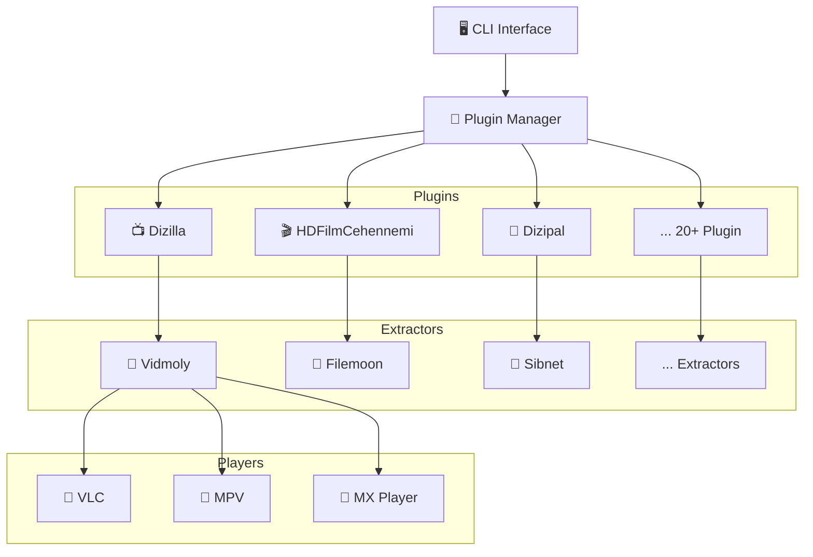

#  KekikStream

[](#)
[](#)
<a href="https://KekikAkademi.org/Kahve" target="_blank"></a>

[](https://pypi.org/project/KekikStream)
[](https://pypi.org/project/KekikStream)
[](https://pypi.org/project/KekikStream)

[](#)
[](#)
[](#)

[](https://github.com/keyiflerolsun/KekikStream/actions/workflows/pypiYukle.yml)

**Modüler ve Genişletilebilir Medya Streaming Kütüphanesi**  
Terminal üzerinden medya içeriği arayın, VLC/MPV ile doğrudan izleyin! 🚀

[](https://github.com/user-attachments/assets/63d31bb0-0b69-40b4-84aa-66623f2a253f)

[](https://www.python.org/)
[](https://GitHub.com/keyiflerolsun/)

---

## 🌟 Genel Bakış

**KekikStream**, Türkçe medya kaynaklarından içerik aramanızı ve popüler medya oynatıcılar ile izlemenizi sağlayan Python kütüphanesidir.

### Temel Özellikler

- 🎥 **Çoklu Kaynak Desteği** - Onlarca Türkçe medya sitesi desteği
- 🔌 **Plugin Mimarisi** - Kolayca yeni kaynaklar ekleyin
- 🎬 **Çoklu Oynatıcı** - VLC, MPV, MX Player desteği
- 🖥️ **CLI & Kütüphane** - Terminal veya kod içinde kullanın
- 🌐 **API ve Web UI Desteği** - [KekikStreamAPI](https://github.com/keyiflerolsun/KekikStreamAPI) ile ağ üzerinden erişim

---

## 🚀 Hızlı Başlangıç

### Kurulum

```bash
# Yüklemek
pip install KekikStream

# Güncellemek
pip install -U KekikStream
```

> **Gereksinimler:** Sisteminizde VLC veya MPV yüklü olmalıdır.

### Temel Kullanım

**Terminal:**
```bash
KekikStream
```

---

## 🏗️ Mimari



---

## ✨ Özellikler

### 🔌 Plugin Sistemi

KekikStream modüler bir plugin mimarisi kullanır. Her medya kaynağı bağımsız bir plugin'dir.

**Mevcut Pluginler:**
- Dizilla, HDFilmCehennemi, Dizipal, Dizifon
- RoketDizi, Sinefy, Moviesseed, FullHDFilmizlesene
- HDBestMovies, SuperFilmGeldi, Sinezy ve daha fazlası...

**Plugin Geliştirme:**
```python
from KekikStream.Core import PluginBase, MainPageResult, SearchResult, MovieInfo, SeriesInfo

class MyPlugin(PluginBase):
    name        = "MyPlugin"
    language    = "en"
    main_url    = "https://example.com"
    favicon     = f"https://www.google.com/s2/favicons?domain={main_url}&sz=64"
    description = "MyPlugin description"

    main_page   = {
      f"{main_url}/category/" : "Category Name"
    }

    async def get_main_page(self, page: int, url: str, category: str) -> list[MainPageResult]:
        # Ana sayfa implementasyonu
        return results

    async def search(self, query: str) -> list[SearchResult]:
        # Arama implementasyonu
        return results

    async def load_item(self, url: str) -> MovieInfo | SeriesInfo:
        # İçerik detayları
        return details

    async def load_links(self, url: str) -> list[dict]:
        # Video bağlantıları
        return links
```

### 🎬 Oynatıcı Desteği

| Oynatıcı | Platform | Özellikler |
|----------|----------|------------|
| **VLC** | Desktop | Custom headers, subtitles, varsayılan |
| **MPV** | Desktop | Custom headers, subtitles |
| **MX Player** | Android | ADB üzerinden |

> **Not:** Özel durumlar için (Google Drive, vb.) arka planda otomatik olarak yt-dlp kullanılabilir.

### 🔗 Extractor Sistemi

Video barındırma sitelerinden direkt streaming linkleri çıkarır:

- Vidmoly, Filemoon, Sibnet, Sendvid
- Voe, Doodstream, Streamtape, Upstream
- Dailymotion, JWPlayer ve daha fazlası...

---

## 🛠️ Geliştirme

### Proje Yapısı

```
KekikStream/
├── KekikStream/
│   ├── Core/              # Temel sınıflar
│   ├── Libs/              # Yardımcı kütüphaneler
│   ├── Plugins/           # Medya kaynak pluginleri
│   ├── Extractors/        # Video extractorları
│   └── __init__.py        # CLI entry point
├── Tests/                 # Örnek kullanım
└── requirements.txt
```

### Yeni Plugin Ekleme

1. `KekikStream/Plugins/` altına yeni dosya oluşturun
2. `PluginBase` sınıfından türetin
3. Gerekli metodları implemente edin (`get_main_page`, `search`, `load_item`, `load_links`)
4. Plugin'i test edin

**Örnek:** [Tests/Single.py](https://github.com/keyiflerolsun/KekikStream/blob/master/Tests/Single.py)

---

## 📊 Performans

| Metrik | Değer |
|--------|-------|
| Plugin Sayısı | 20+ |
| Extractor Sayısı | 40+ |
| Desteklenen Platform | Desktop, Android |
| Async Arama | ✅ |
| Cache Desteği | ✅ |

---

## 🤝 Katkıda Bulunma

Projeyi geliştirmek için katkılarınızı bekliyoruz!

### Nasıl Katkıda Bulunulur?

1. **Yeni Plugin Ekleyin:** Türkçe medya sitesi desteği ekleyin
2. **Bug Raporu:** GitHub Issues kullanın
3. **Feature Request:** Yeni özellik önerileri
4. **Dokümantasyon:** README ve kod dokümantasyonu iyileştirmeleri

### 🎁 Teşekkürler

- [DeoDorqnt387/aniwatch-tr](https://github.com/DeoDorqnt387/aniwatch-tr)

### 💻 Genişletme Referansları

- [keyiflerolsun/Kekik-cloudstream](https://github.com/keyiflerolsun/Kekik-cloudstream)
- [keyiflerolsun/seyirTurk-Parser](https://github.com/keyiflerolsun/seyirTurk-Parser)

## 🌐 Telif Hakkı ve Lisans

* *Copyright (C) 2024 by* [keyiflerolsun](https://github.com/keyiflerolsun) ❤️️
* [GNU GENERAL PUBLIC LICENSE Version 3, 29 June 2007](https://github.com/keyiflerolsun/KekikStream/blob/master/LICENSE) *Koşullarına göre lisanslanmıştır..*


---

<p align="center">
  Bu proje <a href="https://github.com/keyiflerolsun">@keyiflerolsun</a> tarafından <a href="https://t.me/KekikAkademi">@KekikAkademi</a> için geliştirilmiştir.
</p>

<p align="center">
  <sub>⭐ Beğendiyseniz yıldız vermeyi unutmayın!</sub>
</p>
